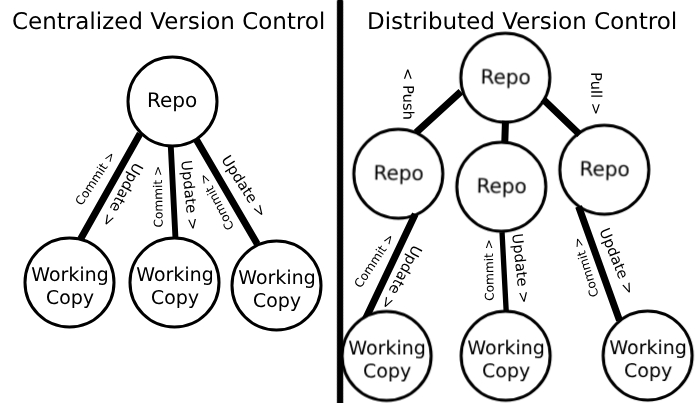
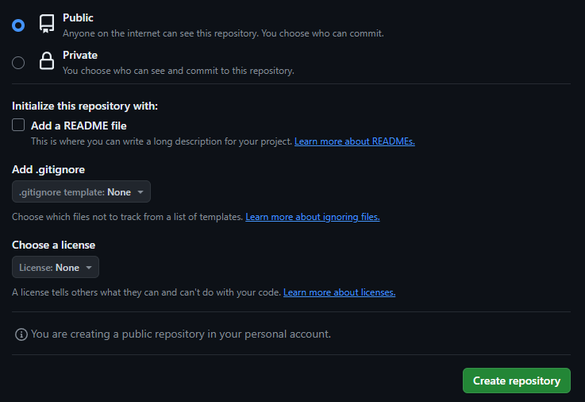
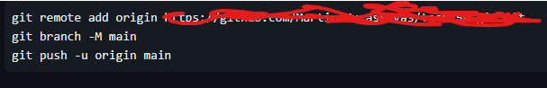
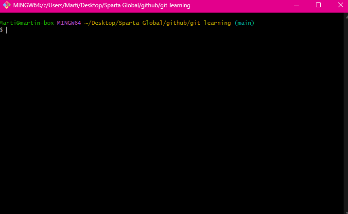
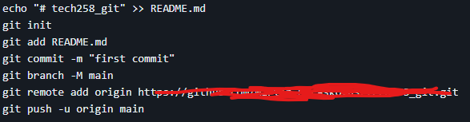

## What is Version Control?
Version control is the practice of tracking and managing changes to software code.
## What is Git? How does it work?
Git is a DevOps tool used for source code management.
It is a free and open-source version control system used to handle small to very large projects efficiently.
Git is used to tracking changes in the source code, enabling multiple developers to work together on non-linear development.
## Basic workflow commands in Git
* `git init`
This command is used to create a new Git repository.
* `git status`
This command shows the current status of the working directory and staging area.
* `git add`
This command adds changes to the staging area of the current repository.
* `git commit -m ""`
This command commits the changes added to the staging area to the current git repository.
#### What can we use `git log` and `git diff` for?
* `git log` is used to display the history of commits to a repository.
* `git diff` is used to display the changes between states of a repository.

## Distributed Version Control

<br>This is a diagram showing how centralized version control works vs. how Distributed version control works.

### What is GitHub?
GitHub leverages the version control tool known as Git in order to allow developers to
create, store, manage, and share their code.
### What are the alternatives to GitHub?
- GitLab
- Bitbucket
- SourceForge
- Phabricator
- Gitea
- Apache Allura
- Launchpad
- AWS CodeCommit

### How do you link a local repo to a remote repo?
- To begin you must log in to Git and create a new repo. This can be done [Here](https://github.com/new)

- You will need to navigate to the local repo that you have and enter these commands.

- This will push all the commits that you have made to your local repo, to your new GitHub repo.
### How do you link a remote repo to a new local repo?
- To begin you must log in to Git and create a new repo. This can be done [Here](https://github.com/new)

- You will then need to go to Git bash and navigate to the folder you want to make the repo in.

- You must then enter these commands:


## Loops
### What are loops? 
  - What are the different types?
    - For loops
      - `for x in y:`
    - While loops
      - `while boolean is True:` or simply `while boolean:`
      - `while boolean is False:` or simply `while not boolean:`
      - Can also use `<`,`>`,`==`,`!=`,`>=`, and `<=`
      - `break` can be used to terminate a loop at any point.
  - What can we do with them? 
    - Loops are typically used to repeat a process a specified amount of times.

### What is a for loop?

```python
name_list = ['jeff', 'jeffery', 'jefferson']
for names in name_list:
    print(names)
```
### What is a While loop?
A while loop will repeat a certain set of instructions until a specified condition is met or broken.

### Why use one instead of a for loop? 
A for loop repeats for a predetermined amount of time but a while loop is used more effectively when it is not known
how many times the process will need to repeat itself to satisfy the condition.

### Are there any dangers to using loops? Anything best practices to consider? 
One key danger to using loops is the risk of ending up in an infinite cycle.
This is where the loop will go continuously until the program is stopped by the user.
To avoid this you must always ensure that your loops have an end condition.
<br>
Example:
<br>
```python
x = True
while x:
    print('hello')
```
This program would print the word hello infinitely as there is no line changing x to False.
The correct approach would be.
```python
x = True
while x:
    print('hello')
    x = False
```
Now we have fulfilled the while loops exit condition.

