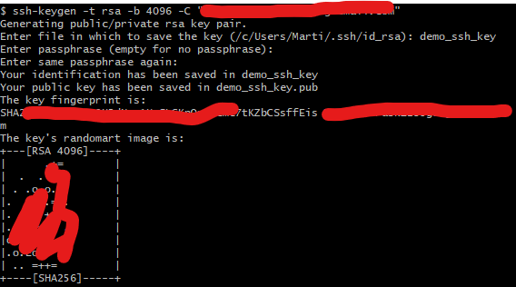
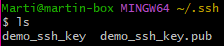
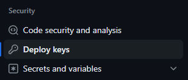
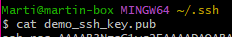
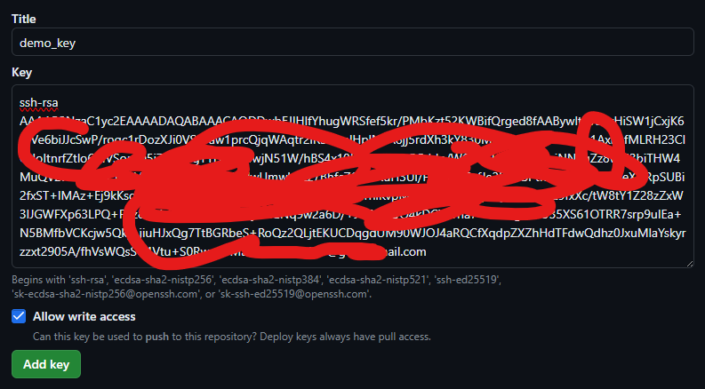
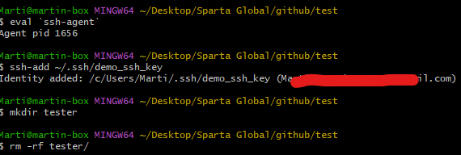
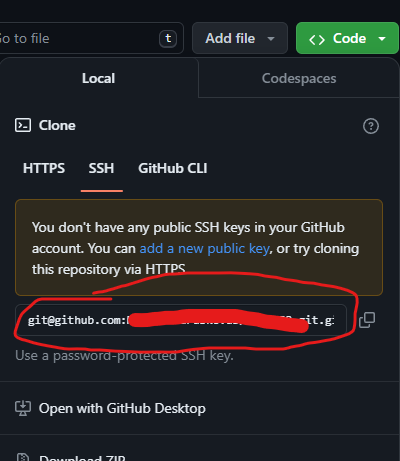

# Setting up SSH Keys with a pre-made GitHub Repository

#### Prerequisites:
For this guide, you need to have a GitHub repository that you want to clone pre-made via GitHub.

## Creating SSH Keys
1. Navigate to your SSH folder in GitBash.
   * This can be achieved by going entering the following commands,
     * `cd` To go to your root directory.
     * `ls -a` This command lists all folders in your current directory.
     * `mkdir .ssh` If you do not see a '.ssh' folder, enter this command to create one.
     * `cd .ssh` This will put you inside your '.ssh' folder.
2. Follow this process to create your SSH Keys.
   * `ssh-keygen -t rsa -b 4096 -C "<YOUR_EMAIL>"`
    
   * Press Enter when prompted for a passphrase in order to not set one.
3. Confirm that your SSH keys exist.
    * Enter `ls` into your terminal, and you should see the public and private keys that were generated. 
     

## Pair your public SSH key with your GitHub
1. Head to the settings of the repo that you will be cloning. [Here](https://github.com/Martin-Muraskovas/tech258_git/settings)
2. Select "Deploy Keys". 
   
3. From your ssh folder in GitBash. Enter `cat <keyname.pub` to get your public key.  
   
4. Copy and paste your public key into the Key field of the New SSH form on GitHub. The key will start with ssh and end with your email. Be sure to tick the "Allow write access" option. 
     
5. Add the key and enter your password to confirm.

## Clone a repository using SSH
1. In GitBash navigate to the folder you would like to clone your repository to.
2. Enter the following commands to use your private SSH key to clone the intended GitHub Repo. 
    
3. Now you can clone your repo by doing the following. 
   * Head to your GitHub repository that you will be cloning and copy the circled text below.
     
   * Go to GitBash and type `git clone` then paste what you have just copied.
   * Press enter.
   
**Congratulations!** You have now used SSH keys to clone a remote repository to your local system.

## A diagram of how SSH works conceptually
